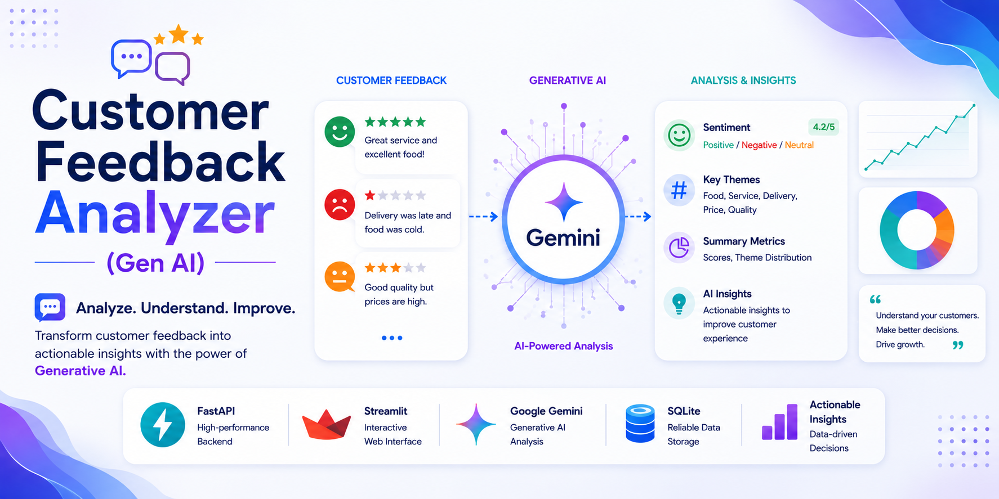
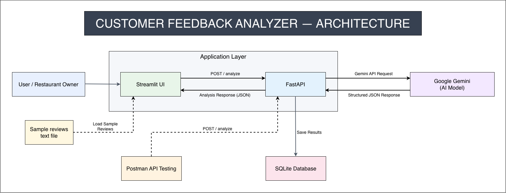
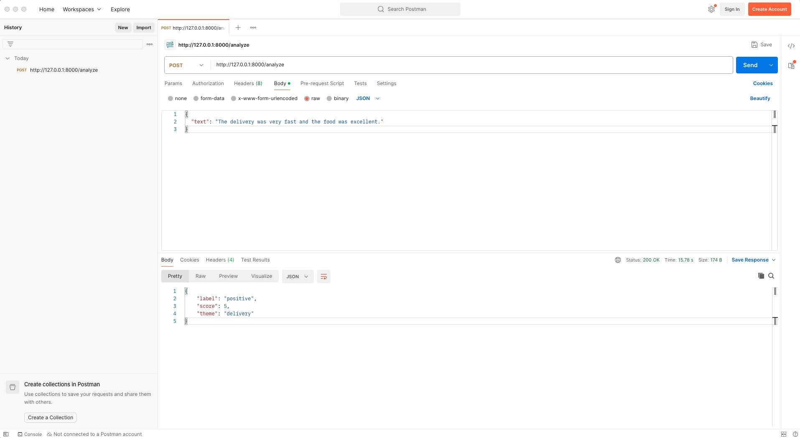
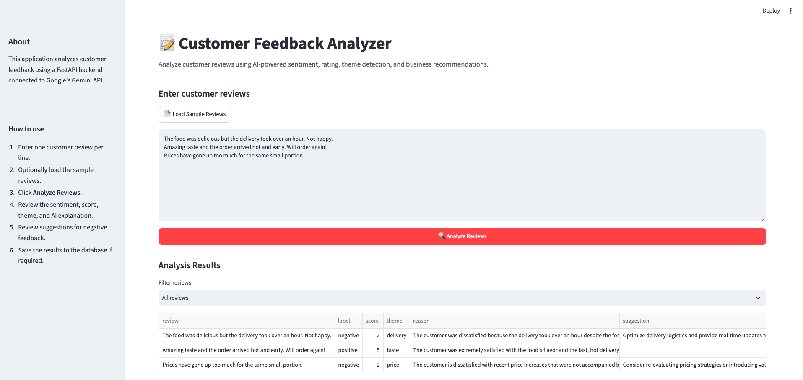
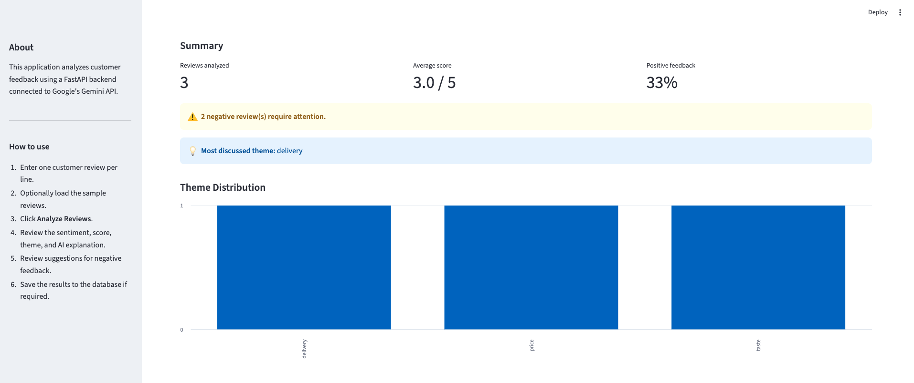
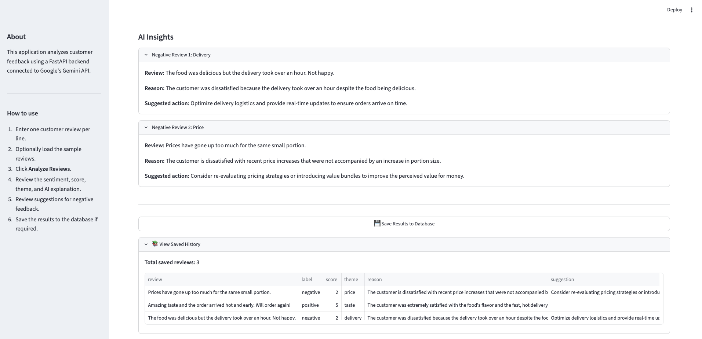

<p align="center">
  
</p>

# Customer Feedback Analyzer (Gen AI)
An AI-powered customer feedback analysis application built with Streamlit, FastAPI, Google Gemini, and SQLite to analyze customer reviews, identify sentiment and themes, generate actionable insights, and store analysis results.

## 🚀 Live Demo
🔗 **Live Application: 

---


---

## 1. Project Overview

**Customer Feedback Analyzer (Gen AI)** is an AI-powered customer feedback analysis application designed to help restaurant owners quickly understand large volumes of customer reviews.

Instead of manually reading and analyzing every review, the restaurant owner can either enter customer reviews directly into the Streamlit application, with one review per line, or load reviews from a local text file. Once the reviews are provided, the application sends each review to a FastAPI backend, which uses **Google Gemini** to analyze the review and return a structured result.
For each review, the application identifies:

- **Sentiment** — Positive, Negative, or Neutral
- **Score** — A rating from 1 to 5
- **Theme** — The main topic of the review, such as delivery, service, quality, taste, or price

The application then provides an aggregated view of the analyzed feedback, including the total number of reviews, average score, percentage of positive reviews, most discussed theme, and theme distribution. Negative reviews can be filtered for focused analysis, with AI-generated insights explaining the issue and suggesting a potential action.

The analyzed results can be saved to a **SQLite database**, allowing the restaurant owner to view previously saved feedback through the application's history section.

The project follows a simple application architecture using **Streamlit for the frontend, FastAPI for the backend API, Google Gemini for generative AI analysis, and SQLite for persistent storage**.

---

## 2. Business Problem

Restaurants receive a continuous stream of customer feedback through online reviews. As the number of reviews increases, manually reading every review becomes time-consuming and makes it difficult for restaurant owners to quickly identify recurring problems and overall customer sentiment.

A restaurant owner may want to answer questions such as:

- Are customers generally satisfied with the restaurant?
- What is the overall rating across the analyzed reviews?
- What aspects of the restaurant are customers talking about most?
- What are the most common issues mentioned in negative reviews?
- Which negative reviews require attention?
- What actions could potentially address the issues raised by customers?

Without an efficient analysis process, valuable feedback can remain hidden within a large volume of individual reviews.

The **Customer Feedback Analyzer (Gen AI)** addresses this problem by providing a simple interface where restaurant owners can submit multiple customer reviews and quickly transform unstructured feedback into structured sentiment, ratings, themes, summary metrics, and actionable AI-generated insights.

---

## 3. Business Objectives

The primary objectives of the **Customer Feedback Analyzer (Gen AI)** are to:

- **Automate customer feedback analysis** by using Google Gemini to analyze individual customer reviews.
- **Identify customer sentiment** by classifying reviews as positive, negative, or neutral.
- **Assign a customer satisfaction score** from 1 to 5 for each review.
- **Identify recurring themes** such as delivery, service, quality, taste, and price.
- **Provide an overall feedback summary** including the number of reviews analyzed, average score, and percentage of positive reviews.
- **Highlight negative feedback** so restaurant owners can quickly identify reviews that may require attention.
- **Generate actionable AI insights** by providing reasons behind negative feedback and suggesting potential actions.
- **Visualize theme distribution** to help identify the topics customers discuss most frequently.
- **Persist analyzed feedback** in a SQLite database so previously saved analysis results can be reviewed later.
- **Provide a simple and accessible interface** through Streamlit, allowing restaurant owners to enter reviews manually or load reviews from a local text file.

---

## 4. Project Highlights

- **Generative AI-Powered Analysis** — Uses Google Gemini to analyze customer reviews and generate structured feedback insights.

- **Flexible Review Input** — Allows restaurant owners to enter multiple reviews manually, with one review per line, or load reviews from a local text file.

- **Sentiment & Rating Analysis** — Classifies each review as positive, negative, or neutral and assigns a satisfaction score from 1 to 5.

- **Automatic Theme Detection** — Identifies the primary topic of each review, such as delivery, service, quality, taste, or price.

- **Interactive Summary Dashboard** — Displays the number of reviews analyzed, average score, and percentage of positive feedback.

- **Negative Review Filtering** — Allows users to focus specifically on negative reviews that may require attention.

- **AI-Generated Insights** — Provides a reason and suggested action for individual negative reviews.

- **Theme Distribution Visualization** — Uses a bar chart to show how frequently different themes occur across the analyzed reviews.

- **SQLite Persistence** — Allows analyzed results to be saved locally and retrieved through the saved history section.

- **FastAPI Backend** — Separates the AI analysis logic from the Streamlit interface through a dedicated REST API.

- **API Error Handling** — Handles API request failures and Gemini quota/rate-limit errors without exposing internal exception details to the user.

- **Postman API Testing** — The FastAPI `/analyze` endpoint was independently tested using Postman before integrating it with the Streamlit frontend.

- **Modern Python Environment Management** — Uses `uv` for Python environment and dependency management.

---

## 5. Sample Data Information & Credit

The sample customer reviews used in this project were provided as part of the course **AI-Native Python for Agent Development**, conducted by **Codebasics**.

Full credit goes to **Mr. Dhaval Patel** and the Codebasics team for providing the sample reviews and learning resources used in this project.

> **Note:** The sample customer reviews provided as part of the course materials are not included in this GitHub repository.

This project is created strictly for educational and portfolio demonstration purposes.

---

## 6. Tools & Technologies

| Technology / Tool | Purpose |
|---|---|
| **Python 3.11+** | Core programming language used to build the application |
| **uv** | Python environment and dependency management |
| **FastAPI** | Backend REST API that receives customer reviews and communicates with Gemini |
| **Google Gemini** | Generative AI model used to analyze customer reviews and generate structured insights |
| **Pydantic** | Defines and validates the request and response data models |
| **Streamlit** | Frontend framework used to build the interactive customer feedback dashboard |
| **SQLite** | Local database used to persist analyzed customer feedback |
| **Requests** | HTTP client used by Streamlit to communicate with the FastAPI backend |
| **python-dotenv** | Loads environment variables, including the Gemini API key, from the `.env` file |
| **Postman** | Used to test and validate the FastAPI `/analyze` endpoint independently |
| **PyCharm** | Development environment used to develop and run the project |
| **Git & GitHub** | Version control and source-code repository management |
| **draw.io** | Used to design the project architecture diagram |

---

## 7. Project Structure

```text
customer_feedback_analyzer/
│
├── app.py
├── api.py
├── database.py
├── pyproject.toml
├── uv.lock
├── .python-version
├── sample.env
│
├── assets/
│   └── project_banner.png
│
├── images/
│   ├── customer_feedback_analyzer_postman_api_request.png
│   ├── streamlit_input_and_analysis_results.png
│   ├── streamlit_summary_and_theme_distribution.png
│   └── streamlit_ai_insights_and_saved_history.png
│
├── project_architecture/
│   ├── customer_feedback_analyzer_architecture.drawio
│   └── customer_feedback_analyzer_architecture.png
│
├── README.md
└── .gitignore
```

---

## 8. Project Architecture

The **Customer Feedback Analyzer (Gen AI)** follows a simple three-layer architecture consisting of a **Streamlit frontend**, **FastAPI backend**, and **SQLite database**, with **Google Gemini** providing the generative AI capabilities.



---

## 9. Project Workflow

The Customer Feedback Analyzer follows an end-to-end workflow that connects the Streamlit frontend, FastAPI backend, Google Gemini, and SQLite database.

1. Set up the Python environment and project dependencies using `uv`.
2. Start the FastAPI backend and integrate it with Google Gemini for customer review analysis.
3. Test the FastAPI `/analyze` endpoint independently using Postman.
4. Start the Streamlit frontend and provide customer reviews manually or load them from a local text file.
5. Send each review from Streamlit to the FastAPI backend for analysis.
6. Use Google Gemini to analyze each review and return the sentiment label, score, and theme.
7. Display the analysis results, summary metrics, theme distribution, and AI-generated insights in the Streamlit dashboard.
8. Save the analyzed results to SQLite and retrieve them through the saved history section.

### 9.1 Virtual Environment (`uv`) Setup

The project uses **uv** for Python environment and dependency management.

The project was initialized with `uv`, and the required dependencies were defined in `pyproject.toml`.

To synchronize the project environment and install the required dependencies:

```bash
uv sync
```
The `uv.lock` file stores the resolved dependency versions to support reproducible project environments.

### 9.2 Backend Integration (FastAPI & Gemini)

The backend is implemented using **FastAPI** and provides a REST API endpoint for analyzing individual customer reviews.

The `/analyze` endpoint accepts a customer review as input. The FastAPI backend sends the review to **Google Gemini** for AI-powered analysis.

Gemini analyzes the review and returns a structured response containing:

- **Label** — Positive, negative, or neutral
- **Score** — A rating from 1 to 5
- **Theme** — The main topic of the review, such as delivery, service, quality, taste, or price

The response structure is defined and validated using **Pydantic** before being returned to the Streamlit frontend.

The FastAPI development server can be started using:

```bash
uv run fastapi dev api.py
```

### 9.3 API Testing with Postman

The FastAPI `/analyze` endpoint was tested independently using **Postman** before integrating it with the Streamlit frontend.

A customer review was sent to the `/analyze` endpoint using a `POST` request. The FastAPI backend processed the review using **Google Gemini** and returned a structured JSON response containing the sentiment label, score, and theme.



### 9.4 Frontend Integration (Streamlit)

The frontend is implemented using **Streamlit** and provides an interactive dashboard for the restaurant owner to analyze customer feedback.

The application allows the user to:

- Enter multiple customer reviews manually, with one review per line.
- Load customer reviews from a local text file.
- Submit reviews for AI-powered analysis.
- View the sentiment label, score, and theme for each review.
- Filter the analysis results to focus on negative reviews.



The application also provides summary metrics, including the number of reviews analyzed, average score, and percentage of positive feedback. It also displays the most discussed theme and theme distribution.



For negative reviews, the application provides AI-generated insights, including the reason for the negative feedback and a suggested action. Analyzed results can also be saved to the SQLite database and viewed through the saved history section.



The Streamlit application communicates with the FastAPI `/analyze` endpoint using HTTP requests. Each customer review is sent to the backend individually, and the returned analysis is displayed in the dashboard.

The Streamlit application can be started using:

```bash
uv run streamlit run app.py
```

### 9.5 Database Integration (SQLite)

The project uses **SQLite** to persist analyzed customer feedback locally.

The database functionality is implemented in `database.py`, which is responsible for:

- Creating the feedback table when the application starts.
- Saving analyzed customer reviews and their corresponding results.
- Storing the review, sentiment label, score, and theme for each record.
- Loading previously saved feedback from the database.
- Displaying saved analysis results through the **View Saved History** section in the Streamlit application.

The analyzed results are saved to the SQLite database when the user clicks **Save Results to Database**.

The database integration allows the application to retain previously analyzed feedback and retrieve it later without requiring the reviews to be analyzed again.

---

## 10. Results

The completed **Customer Feedback Analyzer (Gen AI)** successfully integrates the Streamlit frontend, FastAPI backend, Google Gemini, and SQLite database into an end-to-end customer feedback analysis workflow.

The application successfully:

- Accepts customer reviews through manual entry or by loading reviews from a local text file.
- Analyzes individual reviews using Google Gemini through the FastAPI backend.
- Generates a sentiment label, score, and theme for each review.
- Calculates overall summary metrics, including reviews analyzed, average score, and percentage of positive feedback.
- Identifies the most discussed theme and displays the theme distribution.
- Allows restaurant owners to filter and focus on negative reviews.
- Generates AI-powered reasons and suggested actions for negative reviews.
- Saves analyzed feedback to SQLite for future reference.
- Allows previously saved analysis results to be viewed through the saved history section.

The implementation demonstrates a complete workflow from **customer review input → AI analysis → aggregated insights → database persistence**.

---

## 11. Key Takeaways

- Built an end-to-end **Gen AI application** for analyzing customer feedback.
- Integrated **Streamlit** and **FastAPI** to separate the frontend and backend responsibilities.
- Integrated **Google Gemini** to perform sentiment, score, and theme analysis on customer reviews.
- Implemented structured AI responses using **Pydantic** for data validation.
- Implemented review-level analysis along with aggregated customer feedback insights.
- Added **AI-generated insights and suggested actions** for negative reviews.
- Implemented **theme distribution visualization** to identify frequently discussed topics.
- Integrated **SQLite** for persistent storage of analyzed customer feedback.
- Implemented API testing using **Postman** before frontend integration.
- Used **uv** for Python environment and dependency management.
- Implemented API error handling, including handling of **Gemini quota and rate-limit errors**.
- Designed a simple application architecture connecting the frontend, backend, AI model, and database.

---

## 12. Skills Demonstrated

- **Generative AI Integration** — Integrating Google Gemini into an application for customer feedback analysis.
- **Prompt Engineering** — Designing prompts to obtain structured and consistent review analysis from the LLM.
- **Python Development** — Building the application components using Python.
- **REST API Development** — Building and integrating a FastAPI backend with a `/analyze` endpoint.
- **Frontend Development** — Creating an interactive Streamlit dashboard for customer feedback analysis.
- **API Integration** — Connecting the Streamlit frontend with the FastAPI backend using HTTP requests.
- **Data Validation** — Using Pydantic models to validate structured API requests and responses.
- **Database Integration** — Implementing SQLite persistence for analyzed customer feedback.
- **Data Analysis** — Calculating summary metrics and identifying recurring customer feedback themes.
- **Data Visualization** — Creating a theme distribution visualization using a bar chart.
- **API Testing** — Testing the FastAPI endpoint independently using Postman.
- **Error Handling** — Handling API failures and Gemini quota/rate-limit errors appropriately.
- **Environment & Dependency Management** — Using `uv`, `pyproject.toml`, and `uv.lock` to manage the Python project environment and dependencies.
- **Application Architecture** — Designing and documenting the integration between the frontend, backend, AI model, and database.

---

## 13. How to Run the Project

Follow the steps below to run the **Customer Feedback Analyzer (Gen AI)** locally.

### 13.1 Clone the Repository

Clone the project's GitHub repository and navigate to the project directory:

```bash
git clone <your-github-repository-url>
cd customer_feedback_analyzer
```

### 13.2 Install `uv`

If `uv` is not already installed, install it by following the official `uv` installation instructions.

### 13.3 Set Up the Project Environment

Synchronize the project environment and install the required dependencies:

```bash
uv sync
```

### 13.4 Configure the Gemini API Key

Create a `.env` file in the project root directory and add your Google Gemini API key:

```env
GEMINI_API_KEY=<your_gemini_api_key_here>
```

> Note: The `.env` file contains the API key and should not be committed to GitHub.

### 13.5 Start the FastAPI Backend

Open a terminal in the project directory and start the FastAPI development server:

```bash
uv run fastapi dev api.py
```

### 13.6 Start the Streamlit Frontend

Open another terminal in the same project directory and start the Streamlit application:

```bash
uv run streamlit run app.py
```

### 13.7 Provide Customer Reviews

In the Streamlit application, you can either:

- Enter customer reviews manually, with one review per line.
- Load customer reviews from a local text file.

To use the **Load Sample Reviews** functionality, create a local text file named `sample_reviews.txt` in the project root directory and add sample customer reviews, with one review per line.

For example:

```text
The food was delicious and the staff were very friendly.
The delivery was very late and the food arrived cold.
Great service and excellent food quality.
The prices are too high for the portion sizes.
```

> Note: The original sample reviews provided by the course provider are not included in this project's GitHub repository. The reviews above are example reviews for demonstrating how to create your own local sample file.

### 13.8 Analyze and Save Results

1. Provide the customer reviews.
2. Click **Analyze Reviews**.
3. Review the sentiment, score, theme, summary metrics, theme distribution, and AI-generated insights.
4. Click **Save Results to Database** to persist the analyzed results in SQLite.
5. Use **View Saved History** to view previously saved results.

---

## 14. Future Improvements

The following improvements could further enhance the Customer Feedback Analyzer:

- **Batch Review Processing** — Support larger volumes of customer reviews for more efficient analysis.
- **Additional Data Sources** — Integrate customer feedback from sources such as Google Reviews and CSV files.
- **Advanced Analytics** — Add sentiment trends and more detailed analysis of customer feedback over time.
- **Export Reports** — Provide options to export analysis results and summary reports in formats such as CSV or PDF.
- **Production Deployment** — Deploy the FastAPI backend and Streamlit frontend to a cloud platform for real-world usage.

---

## 15. Final Conclusion

The **Customer Feedback Analyzer (Gen AI)** demonstrates how Generative AI can be integrated into a practical business application to simplify customer feedback analysis.

The project combines **Streamlit**, **FastAPI**, **Google Gemini**, and **SQLite** to provide an end-to-end workflow for analyzing customer reviews, identifying sentiment and recurring themes, generating actionable insights, and storing analysis results for future reference.

This project also demonstrates practical skills in **Generative AI integration, API development, prompt engineering, data analysis, database integration, frontend development, API testing, and Python project management**.

Overall, the application provides a simple and practical solution that can help businesses understand customer feedback more efficiently and identify areas that require attention.

